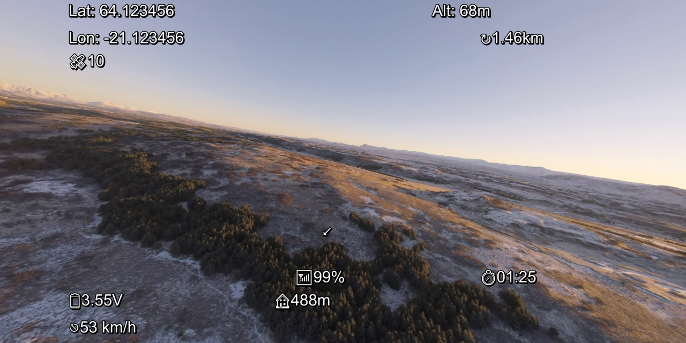

# OSD Subtitles

This utility combines OpenTX telemetry log files with [Betaflight] OSD elements and produces a subtitle file with OSD overlay similiar to the the Betaflight OSD. You can then play your flight video with subtitle OSD elements in a video player like [VLC] or import them into Youtube or some other web player. Not all OSD elements are currently supported and some may display differently from Betaflight.

## Click on [osd-subtitles] to start using the utility.

Read the [how to] on how to use this.

[osd-subtitles]: https://kristjanbjarni.github.io/osd-subtitles/
[Betaflight]: https://betaflight.com/
[VLC]: https://www.videolan.org
[how to]: https://kristjanbjarni.github.io/osd-subtitles/docs/howto.html
